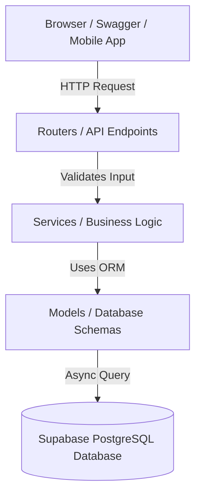

# Smart India Hackathon: AlumniConnect Backend Cheat Sheet

This guide is designed to help you understand every component of your backend so you can confidently answer any technical questions from the hackathon judges.

---

## 🛠️ The Tech Stack (What we used)

| Technology | What it is | Why we chose it (The "Pitch") |
| :--- | :--- | :--- |
| **Python** | The programming language. | Offers clean syntax, massive community support, and rapid development speeds. |
| **FastAPI** | Modern, high-performance web framework. | Outperforms older frameworks (like Flask/Django) due to built-in asynchronous (`async/await`) support. It automatically generates interactive **Swagger UI** documentation. |
| **Uvicorn** | ASGI (Asynchronous Server Gateway Interface) web server. | Acts as the lightning-fast engine that runs your FastAPI application on the cloud server. |
| **SQLAlchemy (Async)** | Object-Relational Mapper (ORM). | Allows us to write database queries using Python code instead of raw SQL, with full asynchronous support to prevent the database from slowing down the server. |
| **PostgreSQL (Supabase)** | The relational database. | The most secure, enterprise-grade open-source SQL database. Hosted on **Supabase** for zero-maintenance cloud database hosting. |
| **Railway** | Cloud Application Hosting platform (PaaS). | Automatically pulls our latest code from GitHub, builds a secure container, and deploys it to the cloud in seconds. |
| **Docker** | Containerization tool. | Packages our code, Python version, and packages into a single container image so that it runs identically on local laptops and the cloud. |

---

## 📐 Project Architecture (How it is built)

We implemented a **Layered (3-Tier) Architecture** to ensure the code is modular, clean, and easily expandable.

### The Three Layers:
1. **Routers (`app/routes/`):** The "Traffic Cops". They listen to incoming HTTP requests (like `POST /verify`), validate that the request has the correct format, and hand it over to the Services.
2. **Services (`app/services/`):** The "Brain". This is where the core logic lives. For example, `PaymentService` calculates the Razorpay amounts, calls Razorpay API, and prepares the receipt.
3. **Models (`app/models/`):** The "Blueprints". These python classes define how tables look in PostgreSQL (e.g. what columns the `Donation` model has).

---

## 🚀 Core Features & Third-Party Integrations

### 1. Security & Authentication (JWT)
* **How it works:** When a user logs in, the backend issues an **Access Token** encoded as a **JWT (JSON Web Token)** signed with a secure server key. 
* **Role-Based Access Control (RBAC):** We built dependencies that inspect the JWT token to restrict actions:
  * Only **Alumni** can post jobs.
  * Only **Students** can apply for jobs.
  * Only **Admins** can view database analytics.

### 2. Payment Gateway (Razorpay)
* **The Pipeline:** 
  1. Frontend asks backend to create a transaction → Backend requests `order_id` from Razorpay.
  2. Frontend opens popup → User pays → Razorpay generates a secure transaction receipt and cryptographic signature.
  3. Backend receives the transaction ID and signature → Backend performs an **HMAC-SHA256 signature verification** using the secret API key to verify that the transaction is real and has not been forged by a hacker.

### 3. File Uploads (Supabase Storage)
* We integrated the **Supabase SDK** to handle media storage. When a user uploads a profile picture or a resume, the backend streams the file directly into a Supabase Storage Bucket and returns a public URL to save in the database.

---

## 💡 Top 5 Hackathon Questions (And how to answer them like a Pro!)

### Q1: "Why did you use FastAPI instead of Django or Node.js?"
> **Answer:** *"FastAPI is built natively on top of Python's ASGI standard, meaning it uses asynchronous code (`async/await`) out of the box. This allows it to handle thousands of concurrent requests with extremely low latency, similar to Node.js, while retaining Python's simplicity and ecosystem. Plus, it auto-generates our API documentation (Swagger UI), saving development time."*

### Q2: "How are you securing user passwords in the database?"
> **Answer:** *"We never store plain text passwords. We hash them using the industry-standard **bcrypt** hashing algorithm. Even if a hacker dumps the entire database, they cannot decrypt the passwords."*

### Q3: "What is your database structure, and how do you handle relationships?"
> **Answer:** *"We are using a relational **PostgreSQL** database. We have distinct tables for Users, Students, Alumni, and Faculty. We link them using foreign key relationships—for example, the `Alumni` table points back to a unique record in the `Users` table via a Foreign Key with CASCADE delete support to maintain database integrity."*

### Q4: "How does your backend prevent fake payment confirmations?"
> **Answer:** *"We implement Razorpay's **Webhook / Signature Verification** pipeline. When a user pays, Razorpay generates a cryptographic signature. Our backend takes the order details and re-calculates the signature using our private `RAZORPAY_KEY_SECRET` in a secure environment. If the signatures match, we approve the donation; if a user tries to mock a successful payment, the signatures will mismatch and our backend rejects the request."*

### Q5: "Is your app deployable to local or on-premise servers?"
> **Answer:** *"Yes! The entire backend is fully **Dockerized**. We have a `Dockerfile` that packages the exact environment (Python 3.11 Slim) and dependencies. This container can be run on our cloud server (Railway), local developer machines, or on-premise college servers using a single command: `docker-compose up`."*
